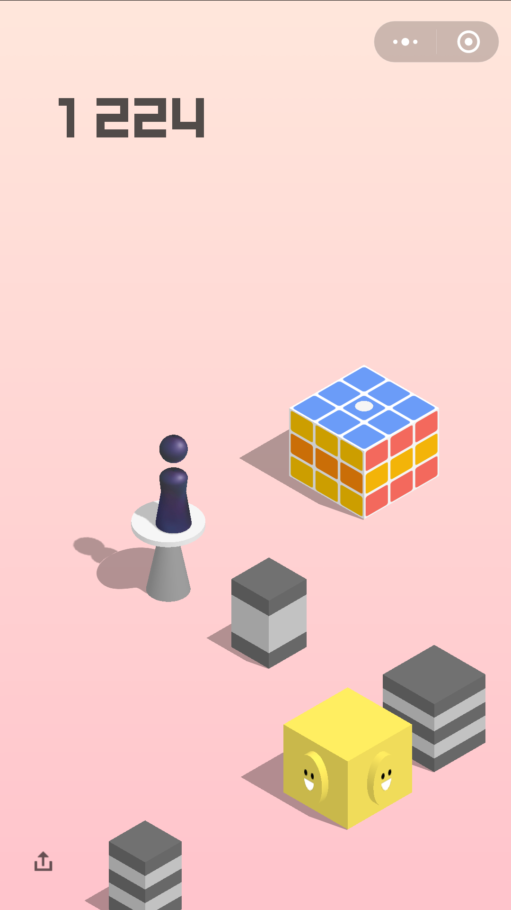

# 微信跳一跳辅助

跳到一千多分我自杀了。估计可以一直跳，中心准确率60%左右



## 环境

1. 准备Java运行与编译环境
2. ADB工具，现在adb似乎是不用sdk的：https://zhuanlan.zhihu.com/p/24772817
[下载](http://adbshell.com/upload/adb.zip)
3. 准备好一部已经打开开发者模式的Android手机；
打开开发者选项，找到“USB调试（安全设置）允许通过USB调试修改权限或者模拟点击”（在mui上是这样的，在其他手机上，应该也是差不多这样）这个开关，打开它；如果这个权限没有授予，则不能正常触发弹跳；


## 配置

项目是普通java项目，没有依赖，直接用eclipse或者IDEA导入

打开JumperMain类，是入口类，修改参数：

```java
    private static final String ADB_PATH = "D:/Android/adb/adb.exe";

    private static final String workPath = "C:\\Users\\User\\Desktop\\temp";
```


**ADB_PATH**:ADB命令的路径

**workPath**：截取的图片存放的路径

## 执行

请确认是否adb已经联接上你的手机；如果adb连接失败，则会导致截图与拉取截图失败。

打开微信，打开跳一跳游戏，并点击开始；

运行程序（JumperMain中的main方法）观察它自动跳动；

## 原理

参考资料

https://zhuanlan.zhihu.com/p/32643870

https://github.com/burningcl/wechat_jump_hack